# **高阶函数与回调函数**

### **1.回调函数**

在 JavaScript 中，回调函数是作为参数传递给另一个函数的函数，以便外部函数可以在特定点调用它。

forEach 是 JavaScript 中数组的内置方法。它允许迭代数组中的每个元素，并对每个元素执行操作。

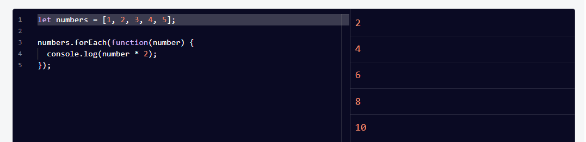

 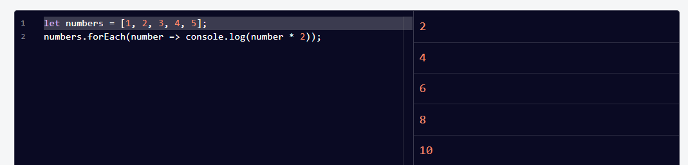

forEach 中的回调函数实际上可以接受最多三个参数：当前元素、当前元素的索引以及调用 forEach 的数组

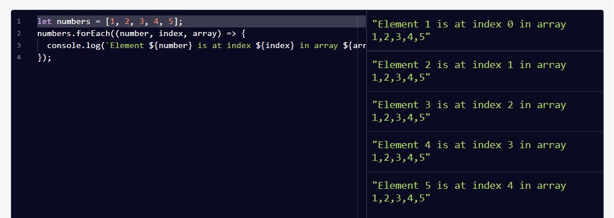 

 

### **2.高阶函数**

本质上，高阶函数是一个函数，它要么接受一个或多个函数作为参数，要么返回一个函数，或者两者兼有。

高阶函数的一个常见用途是抽象复杂的操作。

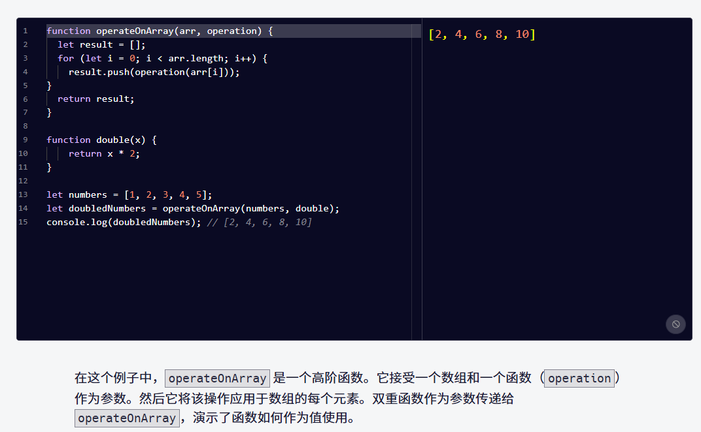

 

高阶函数也可以返回函数。这对于基于更通用的函数创建特化函数特别有用。这个概念通常被称为函数工厂。

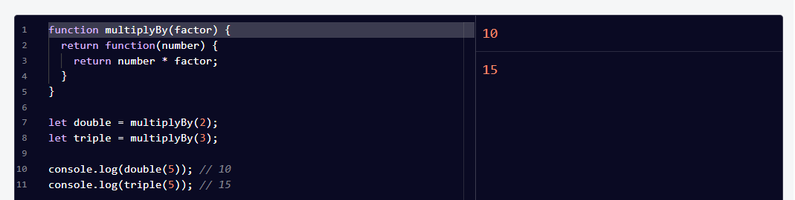 

 

map()、filter() 和 reduce()

### **3.map()**

通过将给定的函数应用到原始数组的每个元素上来创建一个新数组。

此方法不会修改原始数组，而是返回一个包含对每个元素应用函数结果的新建数组。

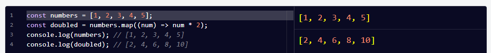 

map 方法接受一个回调函数，该函数会对数组中的每个元素进行调用。

 

回调函数最多可以接受三个参数。

第一个参数是当前正在处理的数组项。

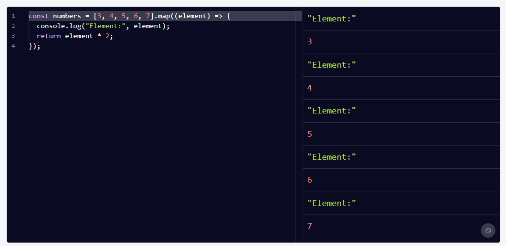 

第二个参数是当前正在处理的元素的索引。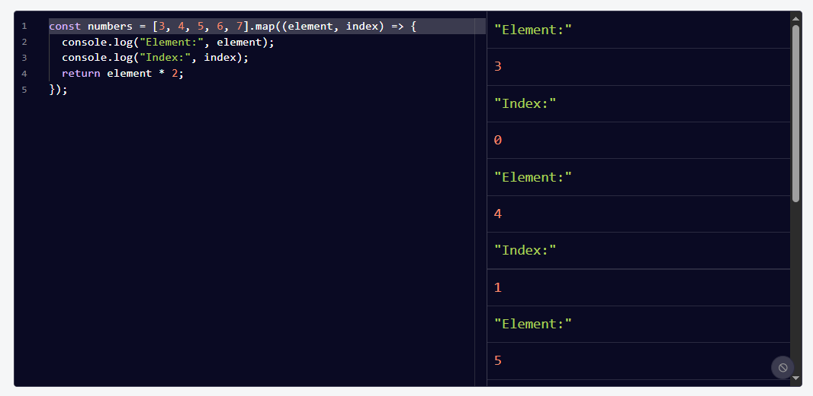

第三个参数是调用 map 的数组。

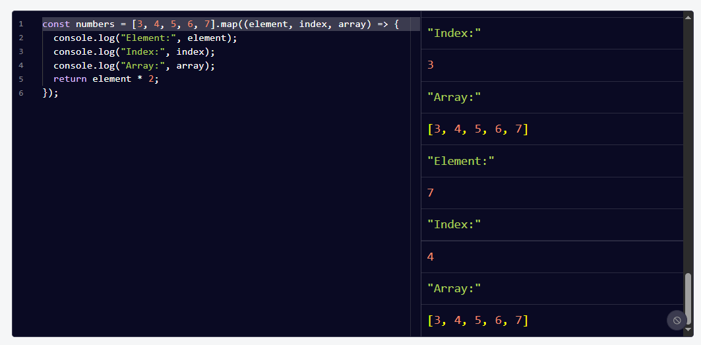 

 

### **4.filter()**

filter 方法用于创建一个包含通过指定测试的元素的新数组，使其在根据条件有选择地提取项时非常有用。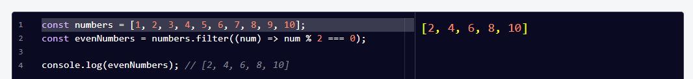

filter 方法的回调函数接受相同的三个参数：当前正在处理的元素、索引和数组。

如果没有元素通过测试，filter 方法会返回一个空数组。

 

filter 非常多功能，可以用于许多场景。可以用它从数组中移除 null 或 undefined 值，基于属性过滤对象，或实现查找功能性。

 

### **5.reduce()**

reduce 方法是 JavaScript 中的一个函数，允许你处理一个数组并将其压缩为单个值。这个单个值可以是数字、字串、对象，甚至是另一个数组。

reduce 的核心工作原理是按顺序将一个函数应用到数组中的每个元素，将每次计算的结果传递给下一个。这个函数通常被称为 reducer 函数。

reducer 函数接受两个主要参数：累加器和当前值。累加器是你保存操作运行结果的地方，当前值是正在处理的数组元素。

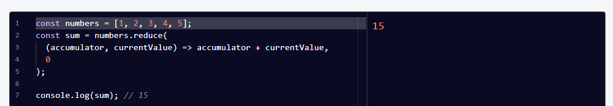 

reducer 函数接受累加器（从 0 开始，由传递给 reduce 的第二个参数指定）并将每个数字添加到它上面。

每次添加的结果成为下一次迭代的新建累加器。

 

reduce 方法也可以将初始值作为第二个参数传入。这是累加器开始时的值。在上面的例子中，我们将其设置为 0。

如果你不提供初始值，reduce 将使用数组的第一个元素作为初始累加器，并从第二个元素开始进程。

 

### **5.方法链**

方法链是一种连续调用多个方法的技术。你可以在 JavaScript 中的多种类型的值上使用方法链，包括字串、数组和对象。尽管字串是原语值，但当你使用字串方法时，JavaScript 会临时将它们包装在一个 String 对象中。

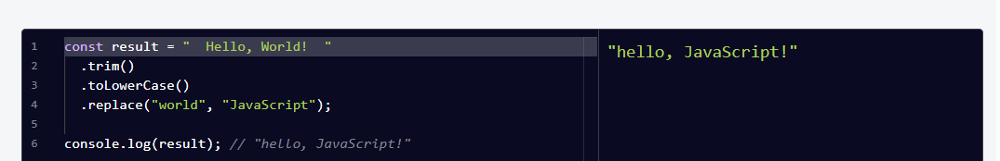 

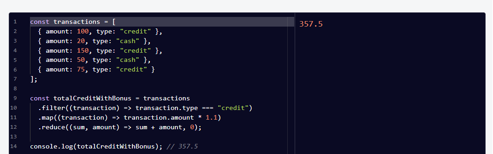 

 

### **6.排序方法**

sort 方法用于排列数组的元素，并返回已排序数组的引用。不会进行拷贝，因为元素是在原地排序的。

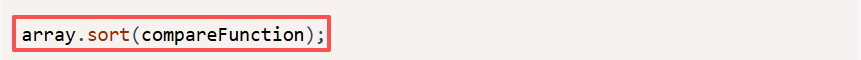 

compareFunction 是一个可选的参数，用于指定定义排序顺序的函数。稍后我们将查看如何在排序数字时使用比较函数。

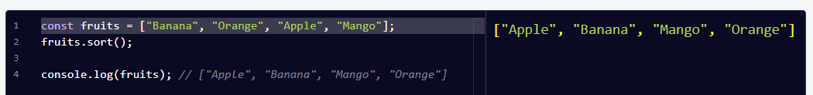 

 

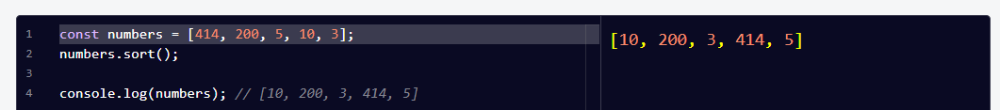 

 sort 方法将元素转换为字串，然后比较它们的 UTF-16 码元序列值。

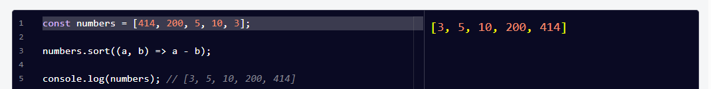 

参数 a 和 b 是被比较的两个元素。如果 a 应该排在 b 之前，比较函数应返回负值；如果 a 应该排在 b 之后，比较函数应返回正值；如果 a 和 b 相等，比较函数应返回零。

 

### **7.every()和some()**

查看数组中的所有元素是否都满足某个条件，或者是否至少有一个元素满足某个条件。

 

every() 方法检查你的数组中的每一项是否满足你指定的条件。

如果提供的函数对数组中的所有元素都返回 true，则 every() 方法返回 true。如果有任何元素未通过测试，该方法会立即返回 false 并停止检查剩余元素。

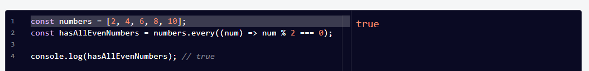 

当 every() 检查所有元素是否通过测试时，some() 检查是否至少有一个元素通过测试。some() 方法一旦找到通过测试的元素就返回 true。如果没有元素通过测试，则返回 false。

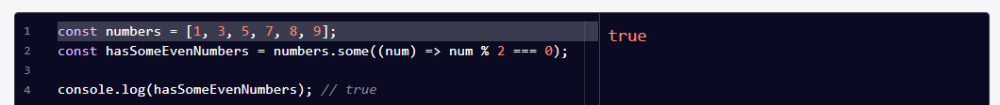 

 

 

# 异步JavaScript

 

### **1.什么是异步的JavaScript**

异步的 event 在不同时间发生，彼此独立。

在软件开发的上下文中，"asynchronous" 指的是在后台运行、独立于程序主流程的任务。异步进程的主要优点是它们不会阻塞主程序的执行。

这对于可能需要较长时间运行的任务特别有帮助，例如从远程 server 获取 data、处理大型 file、处理 user input 以及执行复杂计算。这就是我们所说的异步的 programming。

 

线程是进程内的一个执行单元。它就像程序内的一个独立控件流。

在同步的编程中，线程依次循序执行。如果线程被阻塞，比如等待用户输入，整个进程将被阻塞，直到该线程完成。

在异步的编程中，线程可以并发执行，同时运行多个线程。这样，程序可以继续同时运行多个任务，即使其中一个线程被阻塞，也不会使主程序无响应。

异步的编程通常涉及回调、promise 或 async/await 来处理非阻塞操作。

Promise 是一个对象，表现为异步进程最终完成（或失败）及其值。

 

### **2.**Scritp元素内的async/defer

HTML script 元素中的 async 和 defer 属性在 JavaScript 文件如何在网页中装载和执行方面起着关键作用。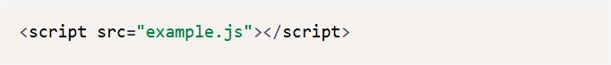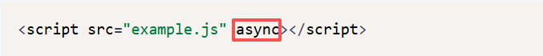

通过为 script 标签添加 async 属性，浏览器将在脚本下载时继续解析超文本标记语言。一旦脚本完全下载，浏览器将暂停超文本标记语言解析，执行脚本，然后恢复解析超文本标记语言。这可以显著加快页面装载速度。

重要的是要注意，异步脚本在下载完成后会立即执行，这意味着它们可能不会按我们期望的顺序运行。这时，defer 属性就派上用场了。让我们看看 defer 属性的样子：

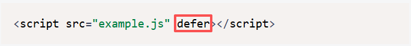 

defer 属性类似于 async 属性。然而，推迟脚本不会在下载完成后立即执行。相反，它们会等待超文本标记语言解析完成后再执行。此外，推迟脚本按照它们在超文本标记语言代码中出现的顺序执行。

### **3.Fetch API**

Fetch API 允许网页应用发起网络请求，通常用于从服务器检索或发送数据。该 API 提供了一个 fetch() 方法，你可以用它来发起这些请求。

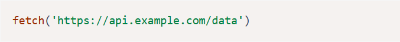 

在这个例子中，我们正在对 https://api.example.com/data 发起一个 GET 请求。然后这将返回一些我们需要转换为 JSON 形式并可以在任何地方使用的数据。

 

**常见的从网络获取的资源类型有哪些？**

在我们的网页应用中，我们需要一些常见的数据，比如天气数据、职业列表数据、国家名称列表、国家代码或国家标记图标/图像。使用这些数据，我们可以使应用更具信息性和互动性。多亏了 Fetch API，我们可以从网络获取这些资源。

图像是一些经常被获取的资源。你可能会根据用户操作使用 fetch 静态或动态地装载图像，并将它们显示在你的网页应用中。

文本文件是另一种经常获取的资源类型。这可能包括配置文件、日志文件，甚至是你想在网页上显示的整个文档。

在某些分支中，你可能会获取音频或视频文件。Fetch API 也可以处理这些类型的资源，使你能够处理各种数据类型。

 

### **4.Fetch API 如何与常见的超文本传输协议方法和 res.json() 一起工作**

Fetch API 的 GET、POST、PUT 和 DELETE 超文本传输协议方法。

GET 方法。它用于从服务器检索数据。当你使用 fetch() 而不指定方法时，默认使用 GET。

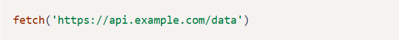 

在这段代码中，我们正在向 https://api.example.com/data 发起一个 GET 请求。现在，请注意你不能直接使用这些数据，你必须将响应转换为 JSON 形式。只有这样你才能在你的项目中任何地方使用它。

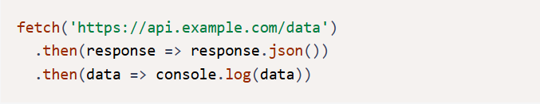 

在这段代码中，来自 Fetch API 的响应是一个 promise，我们使用 .then 处理器将响应转换为 JSON 格式。 Promise 是一个表现异步进程最终完成（或失败）及其值的对象。

Promise 的值在创建时未知。只有当异步进程完成时才知道。当我们将两个 .then 处理器链接到 fetch 调用时，这称为 promise 链式调用。

 

POST 方法用于向服务器发送数据以创建资源。

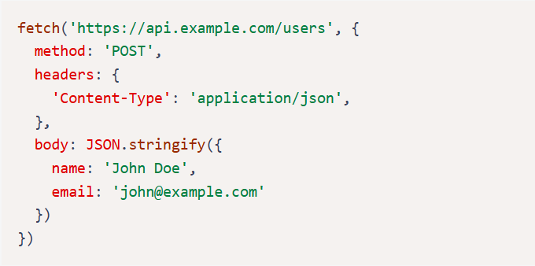 

在此示例中，我们发送一个 POST 请求以创建一个新用户。我们将方法指定为 POST，设置适当的头部，并包含带有我们想要发送的数据的 body。body 需要是一个字串，因此我们使用 JSON.stringify() 将我们的对象转换为 JSON 字串。

 

PUT 方法用于更新服务器的现有资源。

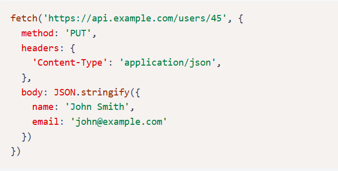 

在这个例子中，仔细观察 URL，可以看到末尾有一个 45。这通常用作唯一 ID 来识别我们试图更新的数据。我们在代码中使用了 PUT 方法，并且还将数据指定为 body，它将用于更新被识别的数据。

 

DELETE 方法用于从服务器删除资源。

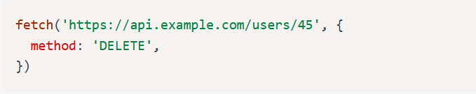 

在这段代码中，我们包含了 DELETE 方法和 url 末尾的 ID 来标识需要删除的数据。

 

### **5.Promise()**

Promise 是一个对象，表现异步操作的最终完成或失败。它最初处于等待状态。然后，当操作成功时，它可以转变为已完成状态；当操作失败时，它可以转变为已拒绝状态。

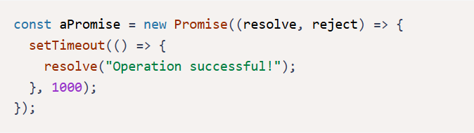 

在此示例中，我们创建一个使用 setTimeout 模拟异步的操作的 promise。经过 1 秒后，promise 会以消息 Operation successful! 解析。

 

另一种处理 promises 的方法是使用 .then 和 .catch 方法。

.then() 方法用于 promise 中指定当 promise 完成时应发生的操作，而 .catch() 用于处理任何发生的误差。

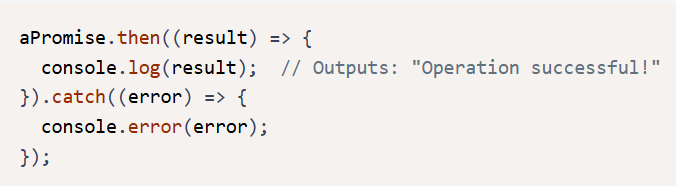 

在这段代码中，或者在承诺完成时要执行的指令中，传递给 .then() 的函数将使用承诺解析后的值被调用。如果发生误差，则会调用传递给 .catch() 的函数。

 

promise 链：promise 的一个强大特色是我们可以将多个异步的操作串联在一起。每个 .then() 都可以返回一个新的 promise，使能够依次执行一系列异步的操作。

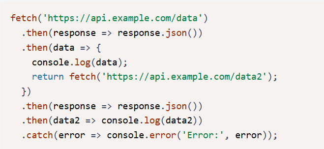 

在这个示例中，我们按序列进行两个 API 调用。第一个 .then() 将响应解析为 JSON。第二个 .then() 记录数据并进行另一个 API 调用。第三个 .then() 解析第二个 API 调用的响应，第四个 .then() 记录该数据。如果在此链中的任何点发生误差，它将被最后的 .catch() 捕获。

 

重要的是要注意 .catch() 会捕获链中任何前面步骤的误差。

 

### **6.****Async/Await**

async/await，基于 promises，使编写和读取异步的代码更容易。当你在函数前加上 async 关键字时，表示该函数总是返回一个 Promise。只有在 async 函数内部，你才能使用 await 关键字，它允许等待一个 Promise 解析后再执行下一行代码。

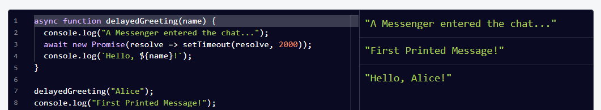 

在这段代码中，我们定义了一个名为 delayedGreeting 的 async 函数。在该函数内部，我们使用 await 暂停执行 2 秒。延迟结束后，它打印一条问候。

当我们调用这个函数时，你会看到 First Printed Message! 在问候语之前出现。这是因为该函数是异步的——它不会阻塞其余代码的运行。

 

async/await 最大的优势之一是误差处理。使用 promises 时，我们经常需要使用 .catch() 方法来处理误差。使用 async/await，我们可以使用 try/catch 块。

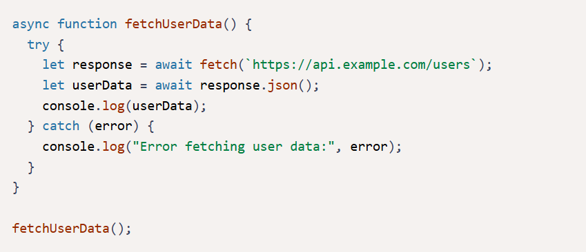 

在此示例中，我们使用 async/await 从 API 获取用户数据。await 关键字使用了两次：一次等待 fetch 操作完成，另一次等待 JSON 解析完成。如果在此过程中发生任何误差，它将被 catch 块捕获。

# **Axios接口调用**

使用Axios在前端调用后端接口的方法有：配置Axios实例、发起HTTP请求、处理响应、错误处理、使用拦截器等。 其中，配置Axios实例是一项重要任务，因为它允许你预设一些默认设置和全局配置，从而简化后续的请求处理过程。

### **一、配置Axios实例**

配置Axios实例可以通过创建一个新的Axios实例并设置默认配置来实现。这种方法可以确保所有的请求都遵循相同的配置，使得代码更加简洁和易于维护。

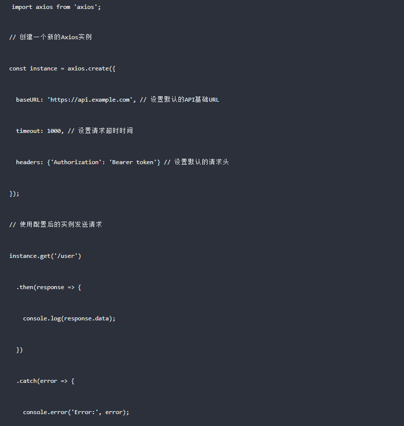 

 

### **二、发起HTTP请求**

Axios支持多种HTTP请求方法，例如GET、POST、PUT、DELETE等。

#### **1. GET 请求**

GET请求用于从服务器获取数据。在GET请求中，参数通常通过URL传递。

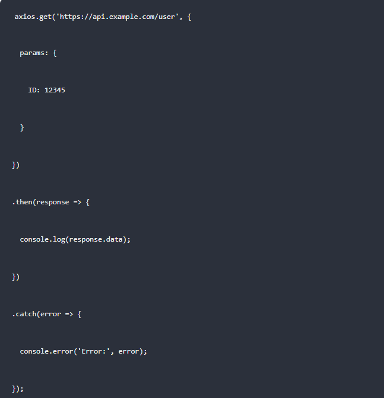 

 

#### **2. POST 请求**

POST请求用于向服务器发送数据。数据通常在请求体中传递。

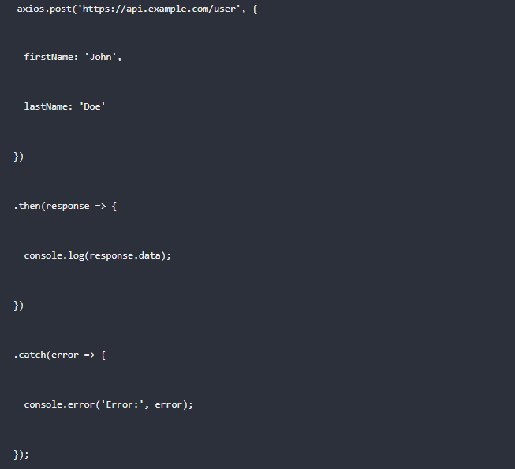 

#### **3. PUT 请求**

PUT请求用于更新服务器上的数据。数据在请求体中传递。

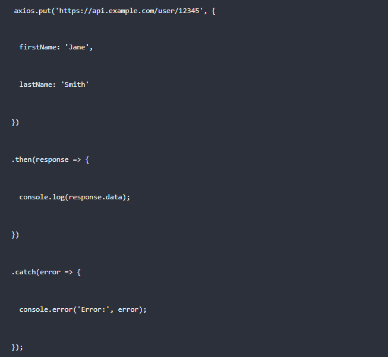 

#### **4. DELETE 请求**

DELETE请求用于删除服务器上的数据。

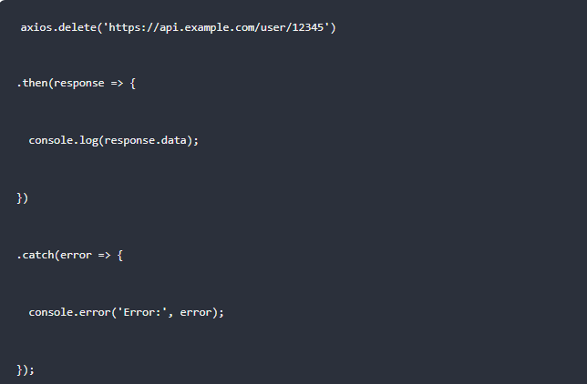 

### **三、处理响应**

在Axios中，响应数据通常通过.then()方法处理。

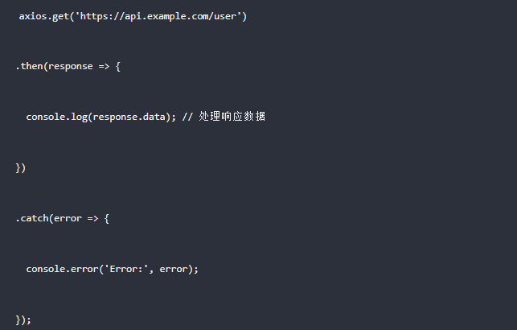 

### **四、错误处理**

在处理HTTP请求时，错误处理是非常重要的。Axios提供了多种方法来捕获和处理错误。

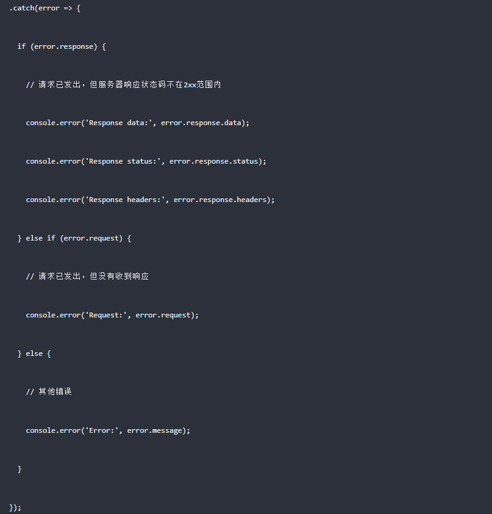 

 

### **五、使用拦截器**

拦截器允许你在请求或响应被处理之前对其进行修改。你可以在请求和响应的拦截器中添加全局逻辑，例如鉴权、日志记录等。

#### **1. 请求拦截器**

请求拦截器可以在请求发送之前对其进行修改。

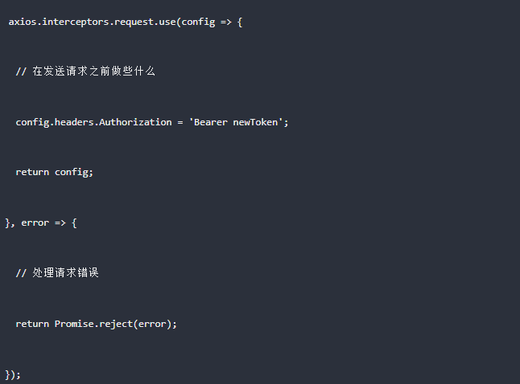 

#### **2. 响应拦截器**

响应拦截器可以在响应到达客户端之前对其进行修改。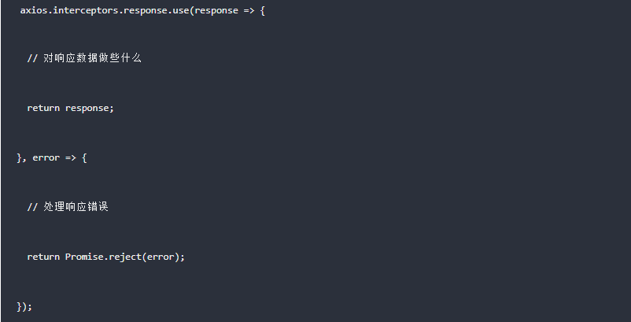
